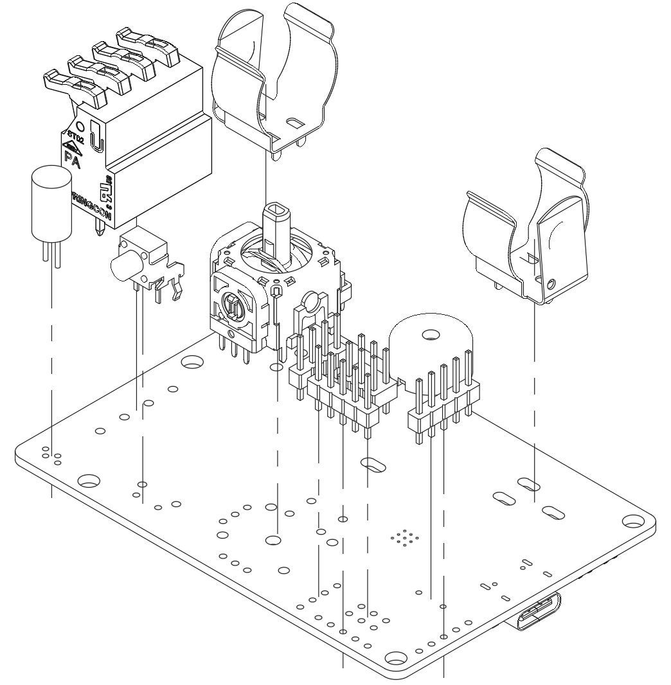

# StepUp! Assembly guide

## Folder Structure
```
/Hardware/3D print files
|
|___/3D print files         // Files for 3D printing the StepUp! project enclosure
|
|___/PCBA files             // Files for re-creating the StepUp! PCBA
|
|___README.md
```

## PCBA Assembly


## Enclosure assembly


