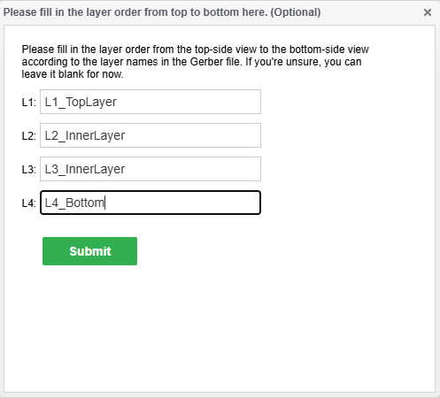
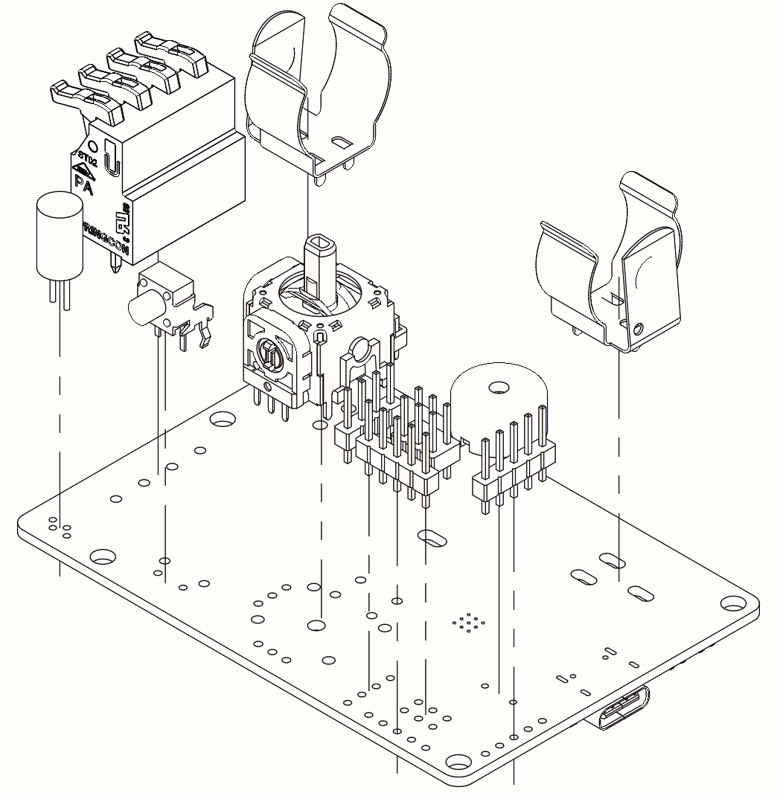
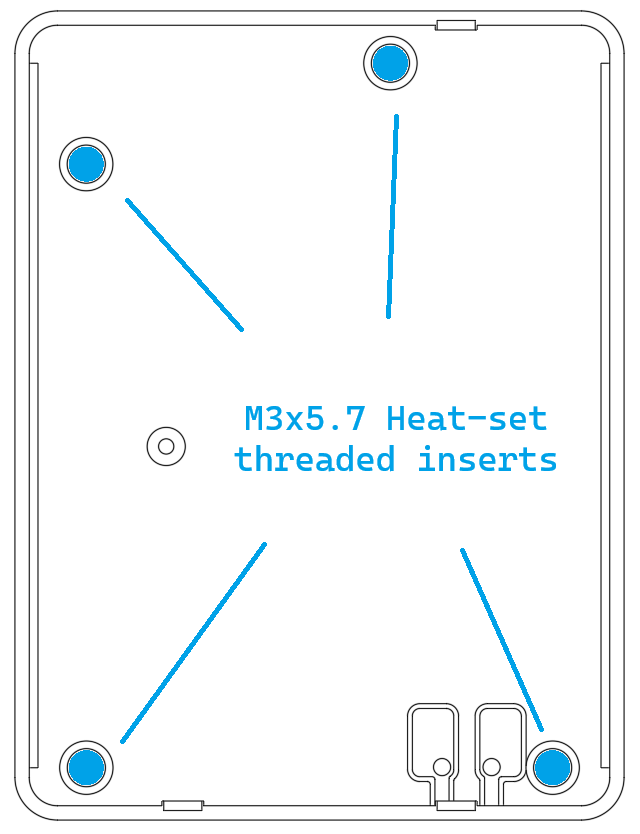
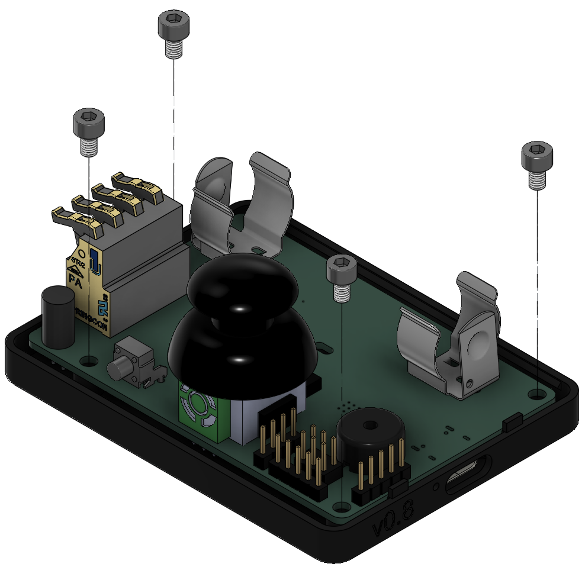
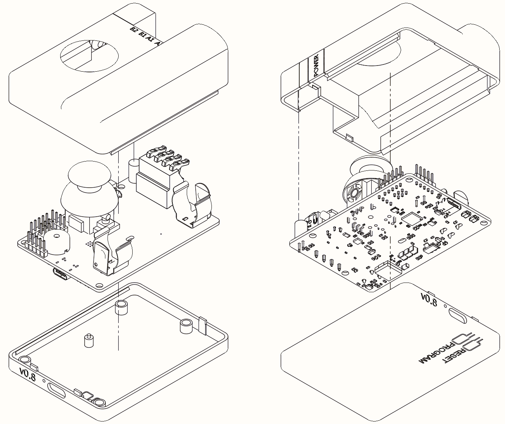

# StepUp! Assembly guide

# Folder Structure
```
/Hardware/3D print files
|
|___/3D print files                                   // Files for 3D printing the StepUp! project enclosure
|
|___/PCBA files/v1.0                                  // Files for re-creating the StepUp! PCBA
|   |___Hand Assembly
|       |___BoM - Hand Assembly components.csv        // Bill of Materials for through-hole hand-assembly components
|       |___Interactive BoM.html                      // Interactive HTML file to assist with component assembly process
|   |___/Manufacturing files
|       |___BoM                                       // Bill of Materials for PCBA
|       |___Gerbers & Drill files.zip                 // Manufacturing files for PCBA production
|       |___Pick & Place.zip                          // Manufacturing files for PCBA production
|   |___STEP                                          // 3D file of PCB
|
|___README.md
```

# Pre-requisites
To fully assembly 1 x StepUp! device - you will need the following
- 1 x StepUp! PCBA - assembled with Top-side SMD components
- 1 x Hand Assembly bottom side components - see "BoM - Hand Assembly components.csv"
- 1 x 3D printer
  - ~50g of PLA or PETG filament for the Top and Bottom sections of the enclosure
  - ~5g of translucent PLA or PETG filament
- 1 x soldering iron & spool of solder
- 1 x 18650 Li-Ion battery (recommended: 2500mAh or higher)
- 1 x Joystick rubber head piece (see [link](https://www.ifixit.com/en-eu/products/playstation-dualsense-controller-joystick-cover) or similar)
- 4 x M3x5.7 threaded inserts
- 4 x M3x5 bolts (hex-head preferable)

# PCBA Assembly
The PCBA comes with one side populated with SMD components but still requires some assembly by hand - this is in an effort to reduce overall build costs by doing some of the through-hole assembly in person. This is also a design choice to enable all the UI elements to exist on one side of the PCB (joystick, LED, motor connector etc..).

## Part 1 - PCB creation and SMD component placement

Using your own preference of PCB manufacturer, upload the manufacturing files located in the `Manufacturing files` folder within this directory. This design uses a 4-layer - if prompted for the layer stackup, the following reference can be used:



## Part 2 - Hand Assembly of Bottom side components

The bottom side of the PCB is solely populated by through-hole components which are to be assembled by hand. The `BoM - Hand Assembly components.csv` file can be found in the `Hand Assembly` folder and the components therein should be purchased prior to assembly (as per the pre-requisites section above).

Once you have the components and PCBA to hand, you may reference the `Interactive BoM.html` file as a handy guide for placing the components on the PCB. Additionally, the diagram below shows a 3D perspective of where the through-hole components are located on the PCB.



### Note on Battery clip positioning
When soldering in the negative polarity battery clip, you have the choice of positioning the clip to suit your own 18650 battery as these do not always come in at `65mm` in length. Often, a battery has built-in protection circuitry included will measure around `67mm` (or longer) and so the user may adjust the position of this negative terminal battery clip and solder it in place for their own use case.


# LED Box assembly
With the aid of a small drop of cyanacrolyte (a.k.a super-glue), slide the translucent LED Box onto the Top section of the enclosure housing so that the LED Box is flush to the part.

<div style="display: flex; gap: 20px; justify-content: center;">
  <div>
    
  </div>
  <div>
    
  </div>
</div>

# Threaded inserts

<div style="display: flex; gap: 20px; justify-content: center;">
  <div>
    
  </div>
  <div>
    
  </div>
  <div>
    
  </div>
</div>

## Important - ensure the inserts are set flush
<div style="display: flex; gap: 20px; justify-content: center;">
  <div>
    
  </div>
  <div>
    
  </div>
</div>


# Attaching PCB to Bottom enclosure
Using 4 x M3x5 screws, attach the PCB to the bottom housing assembly as shown in the image below.




# 3D printed housing assembly

Once the PCBA is attached to the bottom assembly, the top piece should just click into place.




# [Optional] Zip-tie support for retaining battery

There is a small likelihood that the battery may become momentarily dislodged during device use if it falls on a hard surface or is shaken vigorously. With this in mind, there is an opening in the PCB which the user may route a zip-tie through to secure the battery in place