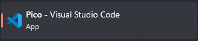
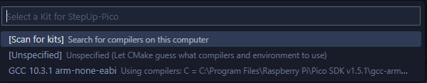
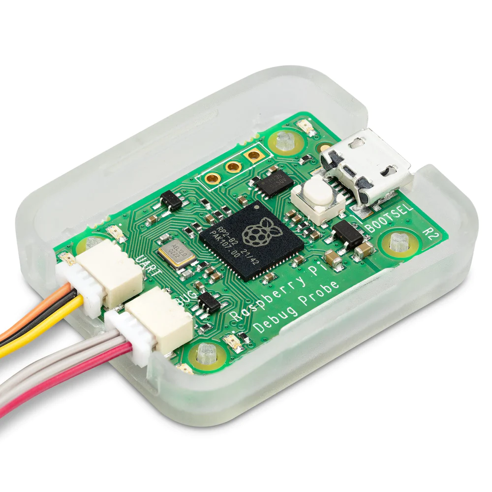

# *StepUp!* - A simple tool for instant stepper motor testing


<a href="https://hits.dwyl.com/SJFOM/StepUp-Pico"></a>
<a href="https://github.com/SJFOM/StepUp-Pico/stargazers"></a>
<a href="https://github.com/SJFOM/StepUp-Pico/network/members"></a>
<a href="https://github.com/SJFOM/StepUp-Pico/pulls"></a>
<a href="https://github.com/SJFOM/StepUp-Pico/issues"></a>
<a href="https://github.com/SJFOM/StepUp-Pico/graphs/contributors"></a>
<a href="https://github.com/SJFOM/StepUp-Pico/blob/master/LICENSE"></a>


## Project Structure

```
/StepUp-Pico
|
|___/App-StepUp             // StepUp! Application source code (C++)
|   |___CMakeLists.txt      // Application-level CMake config file
|
|___/Config
|   |___FreeRTOSConfig.h    // FreeRTOS project config file
|
|___/FreeRTOS-Kernel        // FreeRTOS kernel files, included as a submodule
|___/pico-sdk               // Raspberry Pi Pico SDK, included as a submodule
|
|___CMakeLists.txt          // Top-level project CMake config file
|___pico_sdk_import.cmake   // Raspberry Pi Pico SDK CMake import script
|
|___deploy.sh               // Build-and-deploy shell script (Windows)
|___deploy.py               // Build-and-deploy shell script (OS Agnostic - WIP)
|___program.sh              // Program Pico using a connected debugger tool
|___program_and_monitor.sh  // Program and monitor the Pico using a connected debugger tool
|___build_and_program.sh    // Build and then program the Pico using a connected debugger tool
|
|___rp2040.code-workspace   // Visual Studio Code workspace
|
|___README.md
|___LICENSE.md
```

## Prerequisites

To use the code in this repo, your system must be set up for RP2040 C/C++ development. 

### VS Code extensions

- CMake: `twxs.cmake`
- CMake Tools: `ms-vscode.cmake-tools`
- C/C++: `ms-vscode.cpptools`
- Cortex-Debug: `marus25.cortex-debug`
- Python: `ms-python.python`


### Windows
The Raspberry Pi foundation offer [a simple installer script](https://www.raspberrypi.com/documentation/microcontrollers/raspberry-pi-pico.html#software-development) for Windows users which downloads and configures the following:

- [Arm GNU Toolchain](https://developer.arm.com/tools-and-software/open-source-software/developer-tools/gnu-toolchain/gnu-rm/downloads)
- [CMake](https://cmake.org/download/)
- [Ninja](https://github.com/ninja-build/ninja/releases)
- [Python 3.9](https://www.python.org/downloads/windows/)
- [Git for Windows](https://git-scm.com/download/win)
- [Visual Studio Code](https://code.visualstudio.com/)
- [OpenOCD](https://github.com/openocd-org/openocd/)


Once installed, you will be presented with a version of VS Code pre-pended with the work "Pico" as shown in the image below. 



Use this version of the VSCode IDE from now on whenever developing for the Pico.

Once selected and VS code opens, you will likely be prompted with a choice of "Kit" - you should choose the `arm-none-eabi`




**NOTE:** If an existing `build` folder exists, it is recommended that you delete it before attempting to configure CMake to build your project.

### Mac
(TBD)...

### Linux (WIP)
Run `bin/setup_pico.sh` to configure a Linux machine for programming the Pico

**NOTE:** This guide is a modified version of a setup guide for the Raspberry Pi as offered by the Pi foundation - exercise caution when using!

#### Additional project setup info
Additionally, [this blog post](https://blog.smittytone.net/2021/02/02/program-raspberry-pi-pico-c-mac/) offers additional details on how Pico project setup works and explains how to add new libraries and Pico functionality (e.g. I2C).


### Hardware
This project makes use of the very handy [Raspberry Pi Debug Probe](https://www.raspberrypi.com/documentation/microcontrollers/debug-probe.html) although this is only one of several ways of uploading code to and debugging the Pico microcontroller found on the StepUp! circuit board.



### Debugging on MacOS
To get openocd to play ball, you must install the following libraries as described in the `openocd/README.macOS` file:
```
brew install libtool automake libusb libusb-compat hidapi libftdi
```

### Debugging in Linux

#### 1. Enable `arm-none-eabi-gdb`
To debug in Linux, you need to ensure you have `arm-none-eabi-gdb` installed. If you can build firmware for the Pico, odds are this is already installed on your PC but not symlinked correctly. To link this, run the following with elevated priveleges (`sudo`)
```shell
ln -s /usr/bin/gdb-multiarch /usr/bin/arm-none-eabi-gdb
```
You should now see that running `arm-none-eabi-gdb` works as expected.

#### 2. Configure Linux to recognise device
By following the very useful steps outlined [here](https://forums.raspberrypi.com/viewtopic.php?t=364698), you can configure your udev rules to recognise the Pico plugged in as a CMSIS-DAP interface.

The relevant steps in the linked guide are as follows:
1. Create a file `10-my-usb.rules` in `/etc/udev/rules.d` containing
```
SUBSYSTEM=="usb", ATTRS{idVendor}=="2e8a", ATTRS{idProduct}=="000c", MODE="666", GROUP="plugdev"
```
2. Now, restart the udev service using
```shell
sudo udevadm control --reload
sudo udevadm trigger
```

## Note on debugging (all platforms)
Ensure that both `cortex-debug.openocdPath` in `settings.json` and `configFiles` and `searchDir` key values in `launch.json` refer to the current `Pico SDK v1.5.X` version at time of install.

The environment variable `PICO_SDK_VERSION` should represent what SDK is being used by the development environment - query this environment variable from within your preferred terminal in VS Code to get this value.

## Usage

1. Clone (recursively) the repo: `git clone --recursive https://github.com/SJFOM/StepUp-Pico.git`.
2. Enter the repo: `StepUp-Pico`.
3. Optionally, edit `CMakeLists.txt` and `/App-StepUp/CMakeLists.txt` to configure the project.
4. Optionally, manually configure the build process: `cmake -S . -B build/`.
5. Optionally, manually build the app: `cmake --build build`.
6. Connect your device so it’s ready for file transfer.
7. Copy the `StepUp.uf2` file from the `build/App-StepUp` folder to the drive which represents the attached Pico device hardware.


## IDEs

Workspace files are included for [Visual Studio Code](https://code.visualstudio.com/).

## Credits

This work makes heavy usage of Tony Smith's (a.k.a [smittytone](https://github.com/smittytone)) wonderful [RP2040-FreeRTOS Template](https://github.com/smittytone/RP2040-FreeRTOS) which forms the basic structure for most of this project. Kudos to his work on creating a simple platform to get started with FreeRTOS on the Pi Pico hardware.

## Copyright and Licences

StepUp! application source © 2023, Sam O'Mahony (a.k.a [SJFOM](https://github.com/SJFOM)) and licensed under the terms of the [MIT Licence](./LICENSE.md).

Original template source code © 2022, Tony Smith (a.k.a. [smittytone](https://github.com/smittytone)) and licensed under the terms of the [MIT Licence](./LICENSE.md).

[FreeRTOS](https://freertos.org/) © 2021, Amazon Web Services, Inc. It is also licensed under the terms of the [MIT Licence](./LICENSE.md).

The [Raspberry Pi Pico SDK](https://github.com/raspberrypi/pico-sdk) is © 2020, Raspberry Pi (Trading) Ltd. It is licensed under the terms of the [BSD 3-Clause "New" or "Revised" Licence](https://github.com/raspberrypi/pico-sdk/blob/master/LICENSE.TXT).
