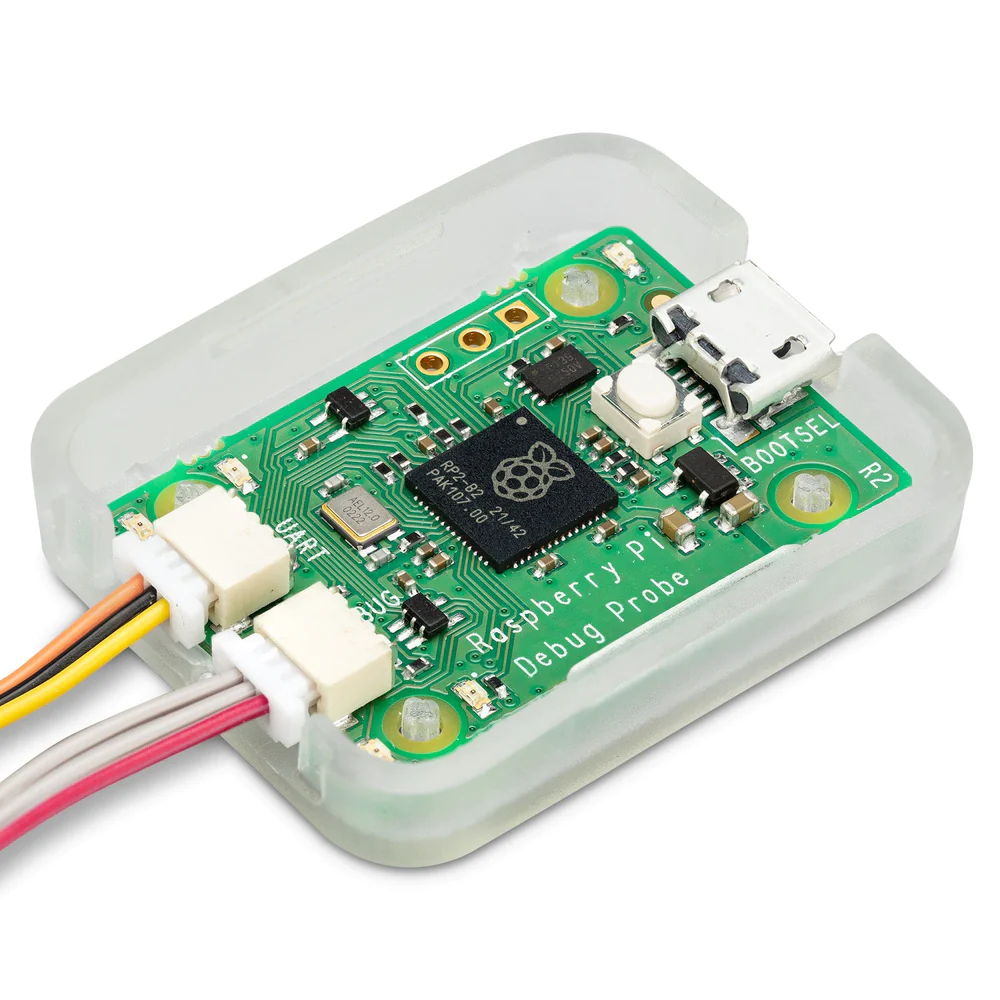
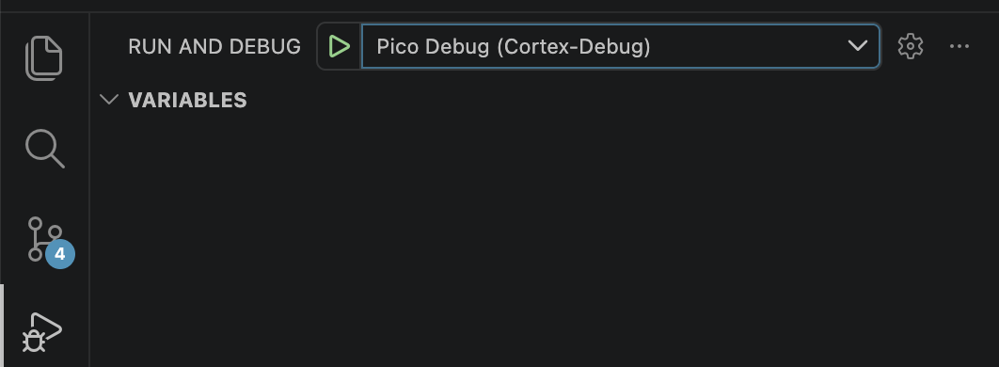

# *StepUp!* - A no-code tool for instant stepper motor testing


<a href="https://hits.dwyl.com/SJFOM/StepUp-Pico"></a>
<a href="https://github.com/SJFOM/StepUp-Pico/stargazers"></a>
<a href="https://github.com/SJFOM/StepUp-Pico/network/members"></a>
<a href="https://github.com/SJFOM/StepUp-Pico/pulls"></a>
<a href="https://github.com/SJFOM/StepUp-Pico/issues"></a>
<a href="https://github.com/SJFOM/StepUp-Pico/graphs/contributors"></a>
<a href="https://github.com/SJFOM/StepUp-Pico/blob/master/LICENSE"></a>


# Hardware


## Project Structure

```
/StepUp-Pico
|
|___/App-StepUp             // StepUp! Application source code (C++)
|   |___CMakeLists.txt      // Application-level CMake config file
|
|___/Config
|   |___FreeRTOSConfig.h    // FreeRTOS project config file
|
|___/FreeRTOS-Kernel        // FreeRTOS kernel files, included as a submodule
|
|___/images                 // Image files used in the README.md
|
|___/Interfaces             // Thin layers for global control - used as parent class
|
|___/Libraries              // Non-HW specific code, commonly used function calls
|
|___CMakeLists.txt          // Top-level project CMake config file
|___pico_sdk_import.cmake   // Raspberry Pi Pico SDK CMake import script
|
|___rp2040.code-workspace   // Visual Studio Code workspace
|
|___README.md
|___LICENSE.md
```


# Prerequisites

## IDEs

This project was developed using Microsoft Visual Studio Code](https://code.visualstudio.com/) and all instructions which follow mention use of its code extensions for working with the StepUp! project. Workspace files are included herein - see [rp2040.code-workspace](./rp2040.code-workspace).


## Getting a copy of this repo

1. Clone (recursively) the repo: `git clone --recursive https://github.com/SJFOM/StepUp-Pico.git`.
2. Enter the repo: `StepUp-Pico`.
3. Optionally, edit `CMakeLists.txt` and `/App-StepUp/CMakeLists.txt` to configure the project.
4. Optionally, manually configure the build process: `cmake -S . -B build/`.
5. Optionally, manually build the app: `cmake --build build`.
6. Connect your device so it’s ready for file transfer.
7. Copy the `StepUp.uf2` file from the `build/App-StepUp` folder to the drive which represents the attached Pico device hardware.


## VS Code extensions

### Required
Raspberry Pi's own [VSCode extension](https://github.com/raspberrypi/pico-vscode) simplifies the installation process for any OS. It includes other necessary VS Code extensions such as [CMake](https://marketplace.visualstudio.com/items?itemName=ms-vscode.cmake-tools) and [Cortex-Debug](https://github.com/marus/cortex-debug) for both CMake file compilation and debugging using OpenOCD via a SWD capable debugger probe respectively.

### Optional
While the Raspberry Pi Pico extension is the only one _required_ to compile code for this project, an ancilliary list of recommended extensions can be found in the included [`extensions.json`](./.vscode/extensions.json) file and will be prompted for install by the VS Code IDE.


# Debugging
While any debug probe offering SWD debugging will work, this project makes use of the very handy [Raspberry Pi Debug Probe](https://www.raspberrypi.com/documentation/microcontrollers/debug-probe.html) and the [`launch.json`](./.vscode/launch.json) file in this repository is configured as such for use with this probe.



A debugging session can be started either through the Raspberry Pi Pico extension or by using the `Run and Debug` extension in the VS Code sidebar. In either case, use the `Pico Debug (Cortex-Debug)` prompt when asked how you want to initalise the session.



## Debugging on MacOS
To get openocd to play ball, you must install the following libraries as described in the (`openocd/README.macOS` file)[https://openocd.org/doc-release/README.macOS]:
```bash
brew install libtool automake libusb libusb-compat hidapi libftdi
```

## Debugging in Linux

### Enable `arm-none-eabi-gdb`
To debug in Linux, you need to ensure you have `arm-none-eabi-gdb` installed. If you can build firmware for the Pico, odds are this is already installed on your PC but not symlinked correctly. To link this, run the following with elevated priveleges (`sudo`)
```shell
ln -s /usr/bin/gdb-multiarch /usr/bin/arm-none-eabi-gdb
```
You should now see that running `arm-none-eabi-gdb` works as expected.

## Note on use Linux for debugging 

To help Linux to recognise the debug probe, you may need to update your `udev` rules 
By following the very useful steps outlined [here](https://forums.raspberrypi.com/viewtopic.php?t=364698). This will configure your udev rules to recognise the Pico plugged in as a CMSIS-DAP interface.

The relevant steps in the linked guide are as follows:
1. Create a file `10-my-usb.rules` in `/etc/udev/rules.d` containing
    ```
    SUBSYSTEM=="usb", ATTRS{idVendor}=="2e8a", ATTRS{idProduct}=="000c", MODE="666", GROUP="plugdev"
    ```
2. Now, restart the udev service using
    ```shell
    sudo udevadm control --reload
    sudo udevadm trigger
    ```

## Credits

This work makes heavy usage of Tony Smith's (a.k.a [smittytone](https://github.com/smittytone)) wonderful [RP2040-FreeRTOS Template](https://github.com/smittytone/RP2040-FreeRTOS) which forms the basic structure for most of this project. Kudos to his work on creating a simple platform to get started with FreeRTOS on the Pi Pico hardware.

## Copyright and Licences

StepUp! application source © 2023, Sam O'Mahony (a.k.a [SJFOM](https://github.com/SJFOM)) and licensed under the terms of the [MIT Licence](./LICENSE.md).

Original template source code © 2022, Tony Smith (a.k.a. [smittytone](https://github.com/smittytone)) and licensed under the terms of the [MIT Licence](./LICENSE.md).

[FreeRTOS](https://freertos.org/) © 2021, Amazon Web Services, Inc. It is also licensed under the terms of the [MIT Licence](./LICENSE.md).

The [Raspberry Pi Pico SDK](https://github.com/raspberrypi/pico-sdk) is © 2020, Raspberry Pi (Trading) Ltd. It is licensed under the terms of the [BSD 3-Clause "New" or "Revised" Licence](https://github.com/raspberrypi/pico-sdk/blob/master/LICENSE.TXT).
