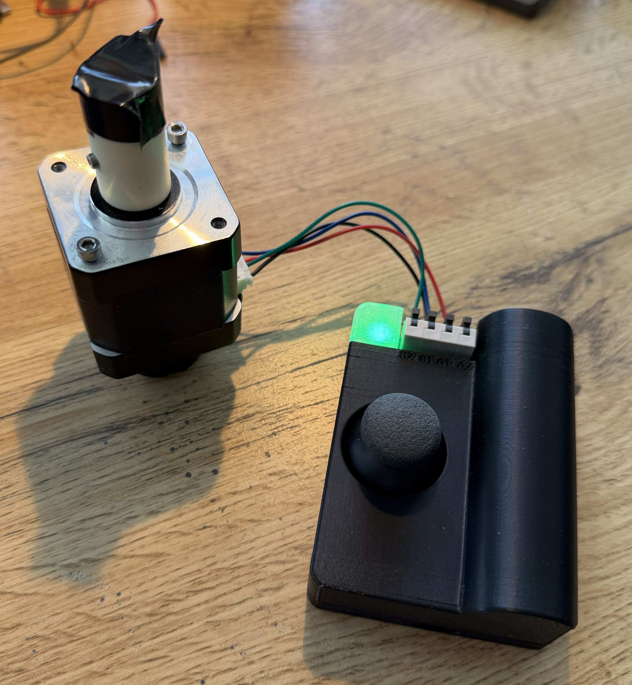
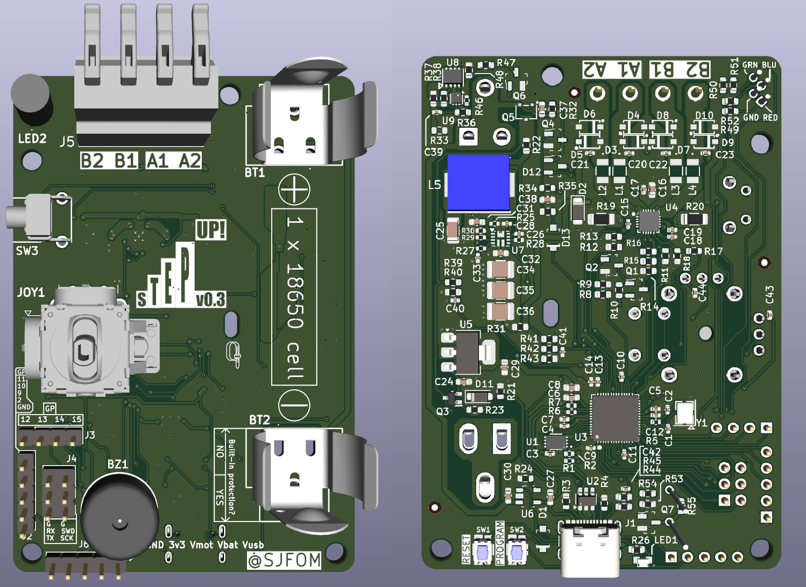
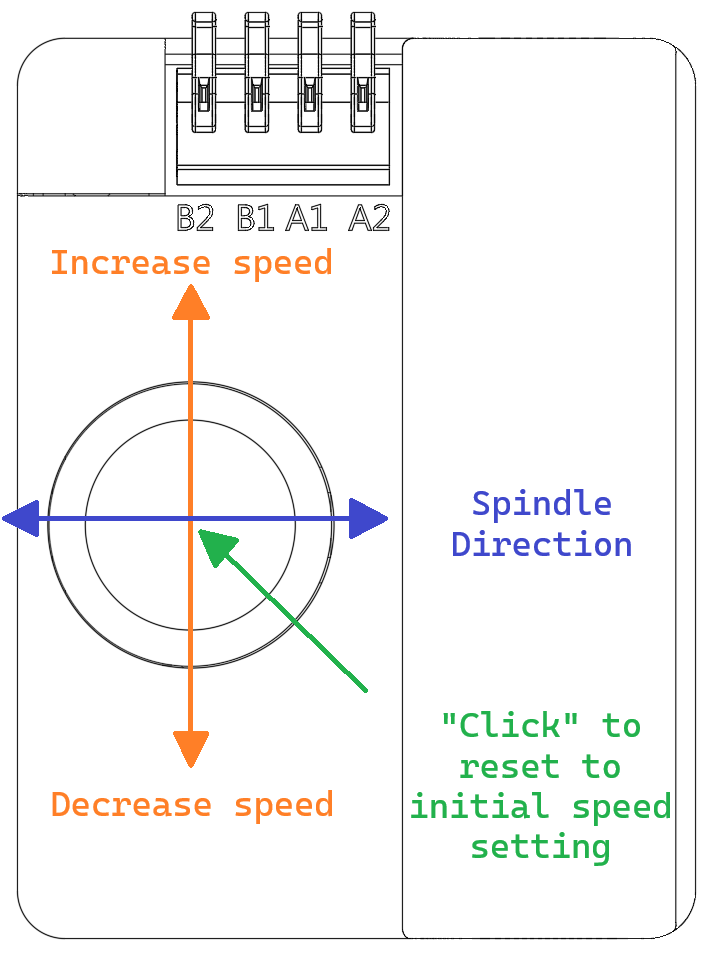

# *StepUp!* - A no-code tool for instant stepper motor testing


<a href="https://hits.dwyl.com/SJFOM/StepUp-Pico"></a>
<a href="https://github.com/SJFOM/StepUp-Pico/stargazers"></a>
<a href="https://github.com/SJFOM/StepUp-Pico/network/members"></a>
<a href="https://github.com/SJFOM/StepUp-Pico/pulls"></a>
<a href="https://github.com/SJFOM/StepUp-Pico/issues"></a>
<a href="https://github.com/SJFOM/StepUp-Pico/graphs/contributors"></a>
<a href="https://github.com/SJFOM/StepUp-Pico/blob/master/LICENSE"></a>






## What is it?
StepUp! is a low-cost, battery powered handheld device for quick testing and development work with stepper motors - all you need is:

- A stepper motor
- A motor cable

## Why did you make it?

Working a lot with stepper motors, I often find myself wanting to test a single motor at a time to understand if its performing as it should - often with questions like:

- Is there an issue with my driving circuit or the motor itself?
- Is the cabling damaged or do the coils contain open or short circuits?
- Is it pulling too much/little current?
- Does it have a hold current or is it jammed?

I found that, to really answer these questions required power supplies and oscilloscopes with expensive current probes attached to really get useful measurements. While this would give me the results I was looking for, the setup was a pain and the measurements were generic and required at least some knowledge of how steppers worked to be interpreted.

I came to the realisation that this problem was two-fold:

1. I don’t have an easy & repeatable way of driving stepper motors
2. I don’t always have all of my lab equipment set up to make the kind of measurements I care about.

>I set out to tackle problem number 1 - creating an easy way to repeatably test a stepper motor


## What makes it special?

There are *plenty* of boards and solutions out there that can drive a stepper motor. However, what I have *yet to see* is a solution that is completely self-contained, requiring no external power supply and driving a stepper motor using input controls from an operator.

My aim is for this to be an item in your toolbox, one that can be called upon whenever you need to test a motor - without all the setup cost.

It is inherently low power - giving just enough juice to get a motor going but with enough power to test out some motor features.

## How much does it cost to build?
### Short answer
Around **€50 (or $60)** per unit

### *Longer answer...*
A core goal from the outset was to make this _as_ cheap as I possibly could. Totting up my most recent order for 5 PCB's with 3 assembled PCBA's and including the additional through-hole components I hand solder to the PCBA's (to reduce cost) works out to around $50 per PCB as per my last order in March 2025.

## Tech specs
- **CPU:** Dual-core Arm Cortex-M0+ processor, flexible clock running up to 133 MHz
- **RAM:** 264kB on-chip SRAM
- **Flash:** 2MB on-board QSPI flash
- **Battery:** 18650 Li-Ion, single cell
- **Charge current:** 300mA
- **Motor control current:** 500mA (default)

# Pre-requisites

## Assembling a StepUp! device
All documentation and pre-requisites for creating your own StepUp! PCB and enclosure can be found in the [Hardware README file](./Hardware/README.md).

## IDEs

This project was developed using [Microsoft Visual Studio Code](https://code.visualstudio.com/) and all instructions which follow mention use of its code extensions for working with the StepUp! project. Workspace files are included herein - see [rp2040.code-workspace](./rp2040.code-workspace).


## Quick-start - cloning the repo and uploading code

1. Clone (recursively) the repo: `git clone --recursive https://github.com/SJFOM/StepUp-Pico.git`.
2. Enter the repo: `StepUp-Pico`.
3. Optionally, edit `CMakeLists.txt` and `/App-StepUp/CMakeLists.txt` to configure the project.
4. Optionally, manually configure the build process: `cmake -S . -B build/`.
5. Optionally, manually build the app: `cmake --build build`.
6. Connect your device so it’s ready for file transfer.
7. Copy the `StepUp.uf2` file from the `build/App-StepUp` folder to the drive which represents the attached Pico device hardware.


## VS Code extensions

### Required
Raspberry Pi's own [VSCode extension](https://github.com/raspberrypi/pico-vscode) simplifies the installation process for any OS. It includes other necessary VS Code extensions such as [CMake](https://marketplace.visualstudio.com/items?itemName=ms-vscode.cmake-tools) and [Cortex-Debug](https://github.com/marus/cortex-debug) for both CMake file compilation and debugging using OpenOCD via a SWD capable debugger probe respectively.

### Optional
While the Raspberry Pi Pico extension is the only one _required_ to compile code for this project, an ancilliary list of recommended extensions can be found in the included [`extensions.json`](./.vscode/extensions.json) file and will be prompted for install by the VS Code IDE.

## Project Structure

```
/StepUp-Pico
|
|___/App-StepUp             // StepUp! Application source code (C++)
|   |___CMakeLists.txt      // Application-level CMake config file
|
|___/Config
|   |___FreeRTOSConfig.h    // FreeRTOS project config file
|
|___/FreeRTOS-Kernel        // FreeRTOS kernel files, included as a submodule
|
|___/images                 // Image files used in the README.md guides
|
|___/Hardware               // Thin layers for global control - used as parent class
|   |___3D print files      // STL files to be 3D printed for StepUp housing
|   |___PCBA files          // Zip file containing Gerbers, Drill files & BoM 
|
|___/Interfaces             // Thin layers for global control - used as parent class
|
|___/Libraries              // Non-HW specific code, commonly used function calls
|
|___CMakeLists.txt          // Top-level project CMake config file
|___pico_sdk_import.cmake   // Raspberry Pi Pico SDK CMake import script
|
|___rp2040.code-workspace   // Visual Studio Code workspace
|
|___README.md
|___LICENSE.md
```

# Using the device

Steps `1` -> `3` below should be followed in the order provided to give best chances of uploading code first time!

If helpful, all PCB schematics for this project can be found in the [Releases section of my KiCad repository](https://github.com/SJFOM/KiCad/releases).

## 1. Inserting a battery
Only 18650 Li-Ion cells are supported by this device. The 18650 cell can either include battery protection circuitry or not - there is a battery protection circuit on-board the StepUp! device which is configured specifically for the device.

>**NOTE:** When first inserting the battery, you must also plug in a USB C cable to power up the device. This is a known quirk of the battery protection circuit which prohibits using the battery until external power is first applied.

## 2. Uploading code to the device

Once a battery has been inserted, plug the device into your PC using a USB C data cable. 

Due to a small hardware quirk, you need to ensure that the `POWER` button (on the side) is held down for the duration of the programming process. Follow these steps to upload code:
1. The `POWER` button on the side of the PCB (or Enclosure box) and
2. The `PROGRAM` button on the bottom of the PCB (or Enclosure box)
3. Press once the `RESET` button to reboot the device into program mode.
4. You can now release the `PROGRAM` button but keep the `POWER` button held down

The device should evaluate as a USB drive mounted to your PC. From here, you can copy the `StepUp.uf2` file to the mounted device either:
- By grabbing the latest copy of [Release firmware](https://github.com/SJFOM/StepUp-Pico/releases) available in the GitHub repo
- OR - locating it in the `build/App-StepUp` directory once you have compiled this repository

## 3. Powering ON
Once firmware has been loaded successfully - press and hold the **POWER** button on the side of the device until a the LED flashes GREEN several times and an audible tone of increasing frequencies plays (like a step-up sequence).

## 4. Controlling the Motor
### Connection
Connect the stepper motor using the connector labelled with `A1, A2, B1, B2` to match the coils of the given motor, lifting the 4 black tabs of the connector 

### Joystick control
The Joystick is used to control the motor direction and speed. If you increase or decrease the speed of the motor and then return the joystick to the center, the next time you move the motor the device will attempt to ramp up to the previous speed the motor was running at. To reset this behaviour, press the joystick button.



### Motor current
By default, the StepUp! device drives the supplied stepper motor with `~500mA` of current. While this _can_ be increased by modifying the firmware (see `DEFAULT_IRUN_VALUE` in [`tmc_control.hpp`](./App-StepUp/include/tmc_control.hpp)) it is not recommended given the limited power available from the provided 18650 battery.

## 5. Status Codes

### USB Connection
The StepUp! device emits a stream of serial messages over USB which can be read while the device is operating - especially if any error message needs to be further diagnosed. The following is an example output stream when the device boots:
```
[INFO] App: StepUp 1.0.0 (9134303:2)
[INFO] Setting up peripherals...
[INFO] Watchdog setup...
[INFO] Watchdog setup... OK
[INFO] Buzzer setup...
[INFO] Buzzer setup... OK
[INFO] LED setup...
[INFO] LED setup... OK
[INFO] TMC2300 setup...
[INFO] TMC - UART pins enable
[INFO] TMC2300 silicon version: 0x40
[INFO] Configure TMC2300 default values...
[INFO] TMC2300 GSTAT register diagnostics:
[INFO]  - Reset?: 1
[INFO]  - Driver shutdown due to error?: 0
[INFO]  - Low supply voltage?: 0
[DATA] Run current: 515 mA
[INFO] Configure TMC2300 default values - OK!
[INFO] TMC2300 setup... OK
[INFO] Boost converter setup...
[INFO] Boost converter setup... OK
[INFO] Voltage monitoring setup...
[DATA] Battery voltage: 4.15V
[INFO] Battery voltage monitoring setup... OK
[DATA] Motor voltage: 10.25V
[INFO] Boost/Motor voltage monitoring setup... OK
[INFO] Voltage monitoring setup...OK
[INFO] Joystick setup...
[DATA] X - Raw value: 2048 - voltage: 1.65V
[DATA] Y - Raw value: 2048 - voltage: 1.65V
[INFO] Joystick setup... OK
[INFO] Setting up peripherals... OK!
[INFO] FreeRTOS timer started successfully!
[INFO] TMC is ready for use
```

### `STANDBY` - When not controlling a stepper motor
| Status | Color: Pattern | Buzzer Pattern | Meaning |
|--------|:----------------:|:---------:|---------|
| Power ON | Green: Fade, low to high | Sequence, low to high | Device is booting - boot complete once tone completes |
| Power ON | Green: Fade, low to high -> Slow blinking Red for 5 seconds -> Solid Red LED | Sweep, low to high -> Continuous beep tone for 5 seconds | Device is booting - fails during boot |
| Ready | Green: Solid | None | Device is ready, LED colour indicates battery HIGH |
| Ready | Orange: Solid | None | Device is ready, LED colour indicates battery MEDIUM |
| Ready | Red: Solid | None | Device is ready, LED colour indicates battery LOW |
| Power OFF | Red: Fast Blinking | Long continuous | Battery critically LOW - Device auto-powers OFF|
| Power OFF | Red: Fast Blinking | Sequence, high to low | User has triggered a power OFF sequence |

### `ACTIVE` - When controlling a stepper motor
| Status | Color: Pattern | Buzzer Pattern | Meaning |
|--------|:----------------:|:---------:|---------|
| Joystick button press | Blue: Fast blinking | Two quick beeps | Reset motor speed to initial starting value |
| Motor moving | Red: Rapid Blinking | Three long beeps | Error detected - issue could be any of the following: Short circuit in motor coils, Open circuit, TMC Overheating, battery voltage out of bounds, motor voltage out of bounds |
| Motor moving | White: Solid for ~1 second | None | **Note:** Stall detection is an experimental feature, not enabled by default. When enabled: Device detected a motor stall event, unable to provide full power due to excessive motor speed. |

## 6. Powering OFF
Press and hold the **POWER** button on the side of the device for 5 seconds until the LED flashes RED several times and an audible tone of decreasing frequencies plays (like a step-down sequence).

>**NOTE:** The device will automatically power OFF after 10 minutes of inactivity


## Charging

When the USB cable is inserted, a small orange LED near the USB port will illuminate indicating the battery is being charged. The battery is fully charged once the LED extinguishes.

>**NOTE:** The StepUp! PCB charges at a modest 300mA. While not the fastest charging speed out there, it is safe and keeps the temperature of the onboard charging IC down.

# Debugging


>**NOTE:** The device must first be powered **ON** for debugging to be enabled.

While any debug probe offering SWD debugging will work, this project makes use of the very handy [Raspberry Pi Debug Probe](https://www.raspberrypi.com/documentation/microcontrollers/debug-probe.html) and the [`launch.json`](./.vscode/launch.json) file in this repository is configured as such for use with this probe.


A debugging session can be started either through the Raspberry Pi Pico extension or by using the `Run and Debug` extension in the VS Code sidebar. In either case, use the `Pico Debug (Cortex-Debug)` prompt when asked how you want to initalise the session.


## Debugging on MacOS
To get openocd to play ball, you must install the following libraries as described in the [`openocd/README.macOS` file](https://openocd.org/doc-release/README.macOS):
```bash
brew install libtool automake libusb libusb-compat hidapi libftdi
```

## Debugging in Linux

### Enable `arm-none-eabi-gdb`
To debug in Linux, you need to ensure you have `arm-none-eabi-gdb` installed. If you can build firmware for the Pico, odds are this is already installed on your PC but not symlinked correctly. To link this, run the following with elevated priveleges (`sudo`)
```shell
ln -s /usr/bin/gdb-multiarch /usr/bin/arm-none-eabi-gdb
```
You should now see that running `arm-none-eabi-gdb` works as expected.

## Note on use Linux for debugging 

To help Linux to recognise the debug probe, you may need to update your `udev` rules 
by following the very useful steps outlined [here](https://forums.raspberrypi.com/viewtopic.php?t=364698). This will configure your udev rules to recognise the Pico plugged in as a CMSIS-DAP interface.

The relevant steps in the linked guide are as follows:
1. Create a file `10-my-usb.rules` in `/etc/udev/rules.d` containing
    ```shell
    SUBSYSTEM=="usb", ATTRS{idVendor}=="2e8a", ATTRS{idProduct}=="000c", MODE="666", GROUP="plugdev"
    ```
2. Now, restart the udev service using
    ```shell
    sudo udevadm control --reload
    sudo udevadm trigger
    ```

## Credits

This work makes heavy usage of Tony Smith's (a.k.a [smittytone](https://github.com/smittytone)) wonderful [RP2040-FreeRTOS Template](https://github.com/smittytone/RP2040-FreeRTOS) which forms the basic structure for most of this project. Kudos to his work on creating a simple platform to get started with FreeRTOS on the Pi Pico hardware.

## Copyright and Licences

StepUp! application source © 2023, Sam O'Mahony (a.k.a [SJFOM](https://github.com/SJFOM)) and licensed under the terms of the [MIT Licence](./LICENSE.md).

Original template source code © 2022, Tony Smith (a.k.a. [smittytone](https://github.com/smittytone)) and licensed under the terms of the [MIT Licence](./LICENSE.md).

[FreeRTOS](https://freertos.org/) © 2021, Amazon Web Services, Inc. It is also licensed under the terms of the [MIT Licence](./LICENSE.md).

The [Raspberry Pi Pico SDK](https://github.com/raspberrypi/pico-sdk) is © 2020, Raspberry Pi (Trading) Ltd. It is licensed under the terms of the [BSD 3-Clause "New" or "Revised" Licence](https://github.com/raspberrypi/pico-sdk/blob/master/LICENSE.TXT).
